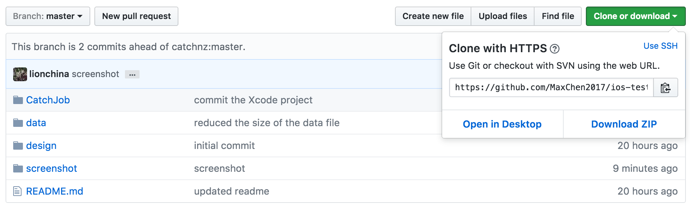
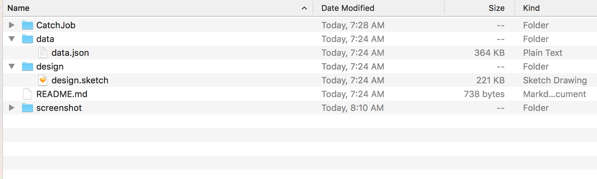
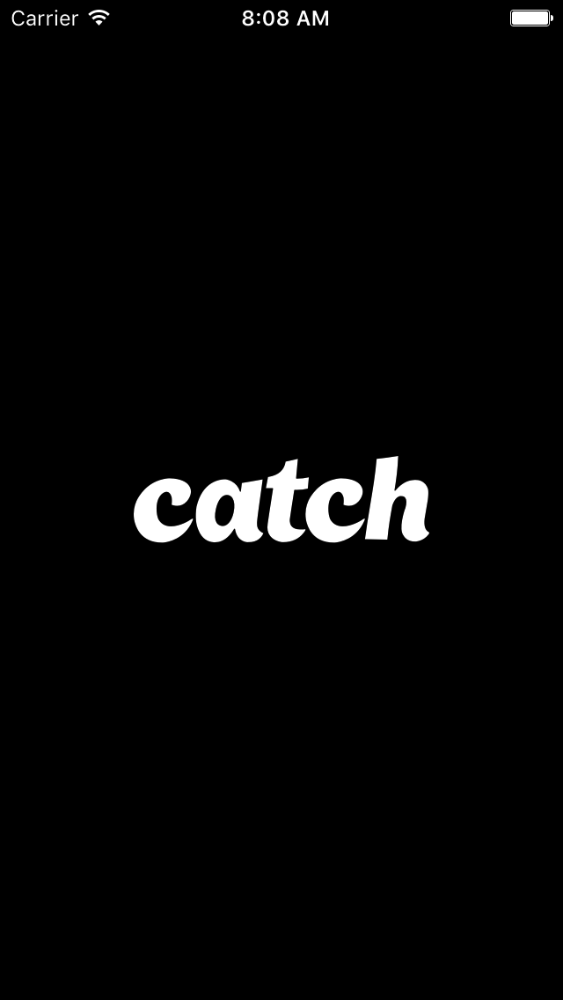
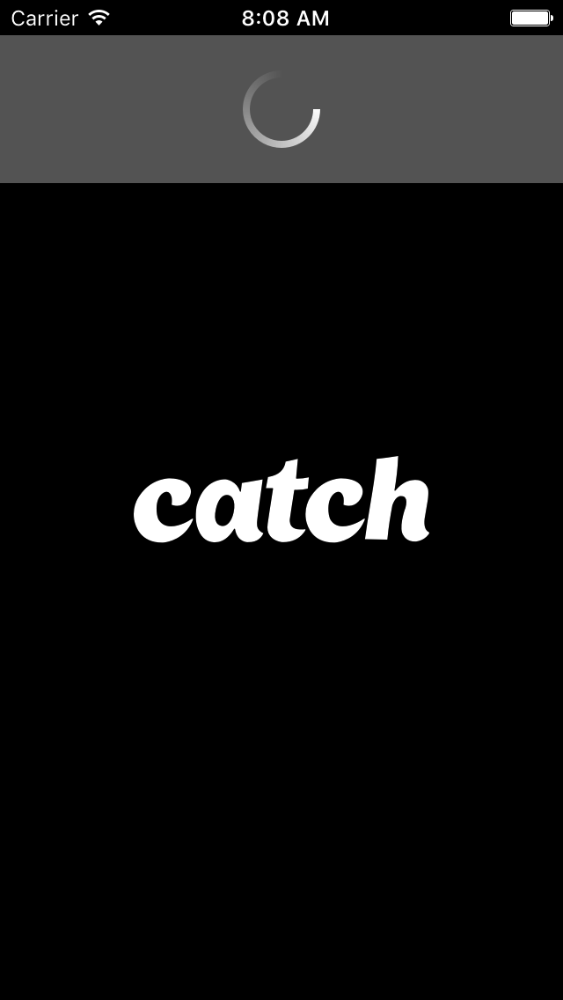
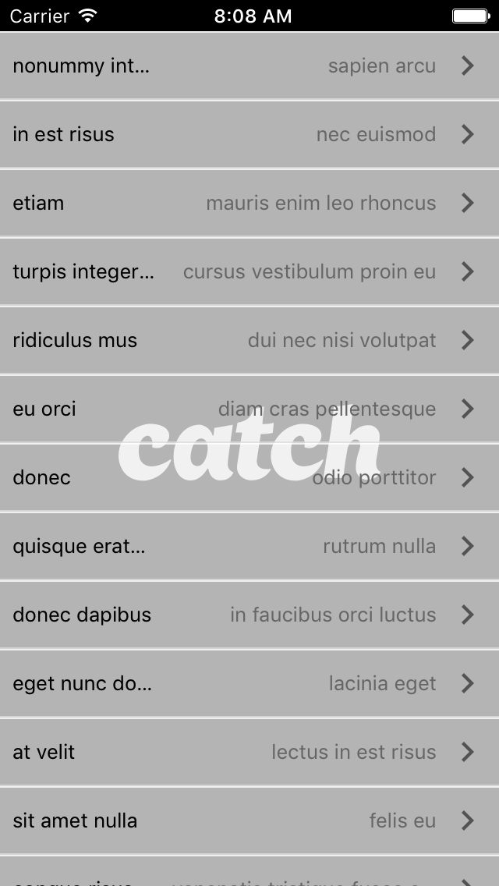
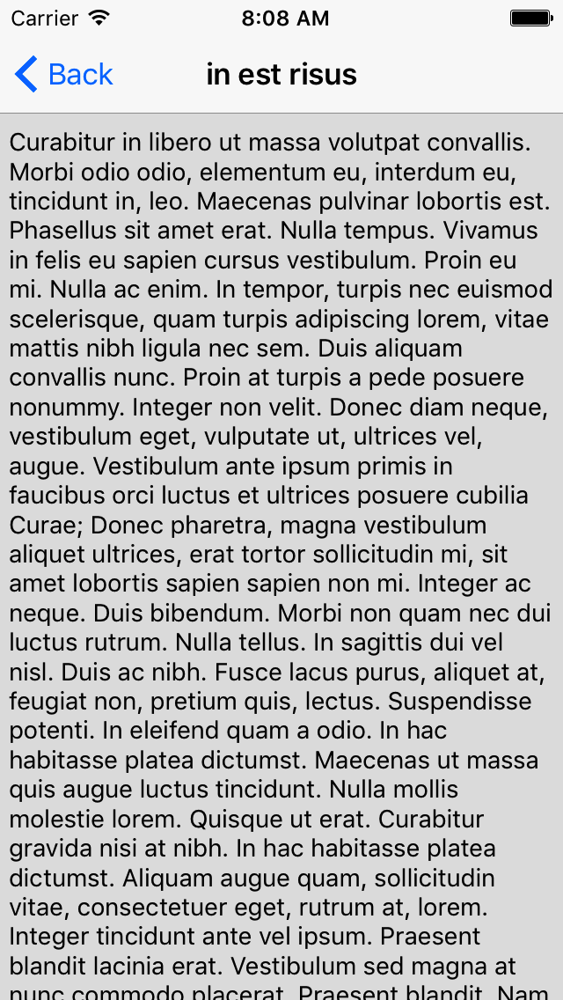
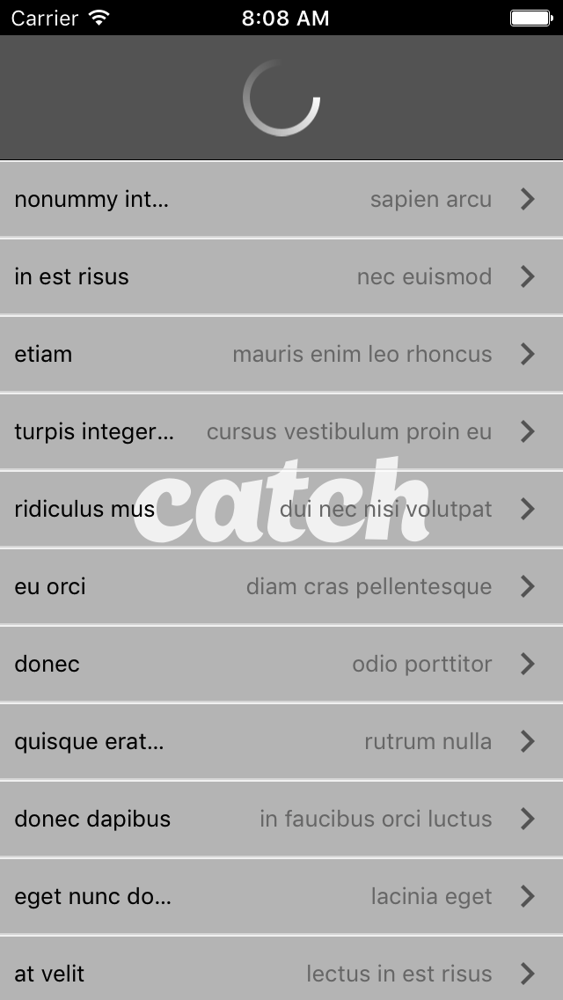

# iOS Developer Test

A simple test for iOS Developers

## Instructions

1. Download thie repo

2. Open CatchJob/CatchJob.xcworkspace

3. Build, Run

4. Test the unit such as parseData function.

### Time

Start at 7:20 and finish the project at about 8:30, Then I modify the ReadMe and do some screenshot job.

### Screenshots

